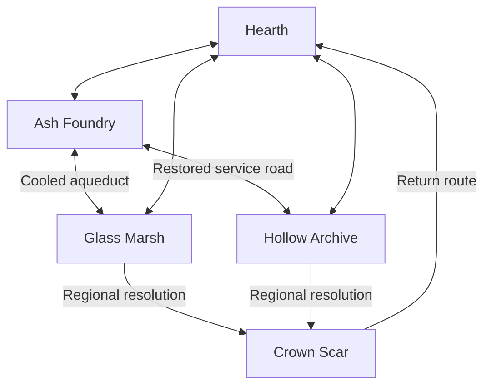
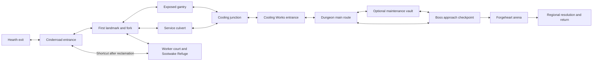

# Connected world and explorable maps

**W01–W06 now have a playable implementation.** See [World implementation](WORLD_IMPLEMENTATION.md) for delivered behavior, compatibility, economy, verification commands and remaining human gates. This document preserves the original proposal; its initial hypotheses and acceptance criteria are not claims of measured player outcomes.

Proposed 8 October 2026, following [Diablo and Path of Exile research](WORLD_MAP_RESEARCH.md). **Design and implementation preparation; no gameplay feature is implemented by this document.** Connected regions are the working direction pending the owner's map preference. This proposal extends [the game design](GAME_DESIGN.md) and supplies the next world-specific queue for [the implementation plan](IMPLEMENTATION_PLAN.md).

## Player experience

The player leaves Hearth through a real exit, follows the Foundry's broken cooling pipes, sees a great kiln before reaching it, and chooses between an exposed gantry and a lower service passage. Off the road, survivors are trapped in a worker court. Reclaiming it creates a refuge and opens a shortcut. The player can rest there, explore a small dungeon, or return to Hearth. Defeating the dungeon's ruler restores the cooling network: the landscape changes, survivors move, and a route into another region opens.

Later, a Fracture returns the player to a recognizable version of that place with altered routes, encounters, and a stated objective. The campaign taught the geography; the expedition asks the player to use that knowledge differently. The Palimpsest fiction connects both experiences.

Success means players remember a place and make decisions within it. A full-screen map, a scrolling camera, or a large terrain image is individually insufficient.

## World structure and scenario

### Three spatial layers

| Layer | What the player decides | What remains stable | What can vary |
| --- | --- | --- | --- |
| Regional world | Which destination, pursuit, or refuge to visit | Geography, landmark identities, travel links, earned access | Story phases, reclaimed services, available activities |
| Explorable zone or dungeon | Which path, optional challenge, or exit to use | Named entrances, authored set pieces, readable route language | Compatible connectors, minor branches, encounter placements |
| Fracture Atlas | Which run, rule set, reward, or frontier to pursue | Discovered destination identities, qualification rules, chapter goals | A bounded seeded expedition graph and disclosed encounter rules |

The regional map is a travel/knowledge view. The local map depicts actual walkable geometry. The Fracture Atlas depicts repeatable expeditions. Their interfaces share a visual language, but their state and function remain distinct.

Use explicit zone boundaries for the first delivery. Inside a zone, the character moves continuously across several screens. The existing 640×360 viewport is a camera window into that geometry. Camera scale stays fixed for combat readability, with independently scaled interface text. A seamless streaming continent can be considered only after zone performance and content throughput are known.

### Geographic logic

Hearth sits at a surviving junction of old transport and cooling infrastructure. Ash Foundry occupies the industrial upland to the west. Runoff leads into the southern Glass Marsh. The eastern Hollow Archive houses the records of the infrastructure's discarded versions. Crown Scar rises to the north, where the First Pattern coordinates its enforcers. Damaged conduits, roads, and archive service routes explain the connections; the map should show them.

This is the proposed physical connection graph, not an assertion that the current game traverses it. After the Foundry introduction, Glass and Hollow can be pursued in either order. Crown entry requires their stated story resolutions, with the gate reason visible. No required path depends on owning an oath, a specific Frame, a Relic, or a random drop. New campaign difficulty is authored by act/zone and any chosen tuning mode; moving between regions does not silently rescale an existing encounter to the player.

### Make the existing fiction causal

The First Pattern stabilizes reality by eliminating incompatible lives and places. Its enforcers keep vital infrastructure functioning, but erase survivors who no longer match their assigned role. The Manyborn can preserve contradictions; doing so must demonstrate both an opportunity and a cost.

Three recurring NPCs anchor the story without a large dialogue production:

- **Mara, a Warden engineer:** wants cooling restored before the Foundry kills its remaining residents. She initially trusts the Pattern's purpose, then witnesses whom it excludes.
- **Iven, an Unbound courier:** uses forgotten service roads to rescue those residents. Their shortcuts work, but some crossings are unstable.
- **Sen, an Archivist:** can recover the network's old plans. They ask the player to preserve evidence of the lives being erased.

The regional quest asks the player to restore the cooling network while saving its inhabitants. The antagonist's action is visible in emptied worker houses and repeated compulsory work rituals. The resolution opens infrastructure and repopulates a refuge. Short optional exchanges explain competing motives; players who skip dialogue still see the problem and its outcome. New dialogue, names, and staging here are original proposed content.

Keep the campaign's main progression convergent. A late choice may affect dialogue, a refuge detail, and the ending vignette, but must not double the maps or alter oath qualification. The First Pattern remains the finale, with a finite story conclusion and continuing uncapped Fractures.

### Region briefs

These are planning briefs, not a commitment to finish every named location before validating Ash.

| Region | Spatial character and landmark | Local scenario | Places to author after the slice | Existing bosses to develop | Visible resolution |
| --- | --- | --- | --- | --- | --- |
| Ash Foundry | Worker courts, gantries, channels; the Great Kiln in the skyline | Cooling is maintained by erasing workers who cannot obey | Cinderroad, Bellhouse, Cooling Works, Kilnheart | Bellkeeper, Forgeheart | Cold channels, an inhabited refuge, a restored aqueduct |
| Glass Marsh | Islands, causeways, reed banks; a leaning mirrored observatory | Inhabitants are trapped behind reflections of a lost flood | Reed Causeway, Drowned Observatory, Mirror Galleries, Widow Basin | Mirror Regent, Reed Widow | A safe causeway and reflections that show the present |
| Hollow Archive | Cloisters, storage courts, indexed wings; a suspended page vault | The Pattern removes people from the records that sustain their homes | Scribe Approach, Index Hall, Unwritten Wing, Abbot Vault | Indexer, Null Abbot | An opened wing, restored names, and a new service passage |
| Crown Scar | Broken civic streets, broad bridges, processional courts; a fractured crown | Stability is offered at the cost of every incompatible life | Procession Road, Marshal Bastion, Crown Bridge, Pattern Chamber | Scar Marshal, First Pattern | A legible campaign ending and access to continuing Fractures |

Each region must differ in geometry, material culture, encounter positioning, ambient sound, and a usable interaction. Changing only its color is insufficient. Reuse kits and enemy behaviors where they support those differences.

## First playable world slice: Ash Foundry

### Contained scope

Author one walkable Hearth exit/approach, one multi-screen Cinderroad zone, Sootwake Refuge within that zone, and one small Cooling Works dungeon with a handcrafted Forgeheart arena. The Bellhouse and full four-region campaign expansion follow later. Reuse the three existing Frames and their combat contracts. Do not add new classes, talent trees, currencies, or oaths to prove this feature.

The first preview uses an isolated, explicitly labeled world-preview profile. This makes route and reward experiments reviewable without converting ordinary saves into an unfinished campaign. Production activation occurs only when W06 supplies complete campaign routing and migration evidence. A preview Fracture uses an explicitly sandboxed endgame profile; defeating the Foundry alone must not become a production campaign-completion or oath-qualification grant.

Both fork routes are viable for every Frame and ordinary Traverse. The gantry offers long sightlines and maneuvering but exposes the player to ranged packs. The culvert offers cover and closer engagements with broad enough spaces for melee and evasion. Its reward can differ, but neither route is the universally superior path. The vault is a compact optional detour with its own endpoint, rather than a key needed to finish the dungeon.

### Scenario sequence

| Beat | Player action | World evidence | Saved result |
| --- | --- | --- | --- |
| Hearth | Talk briefly to Mara or inspect the cooling board, then use the west exit | Steam/ash reaches the sanctuary; a pipe and distant kiln indicate the direction | Main objective and entrance discovery |
| Approach | Fight a readable mixed pack and follow the infrastructure | Worker houses transition into service machinery | Encounter receipt, revealed local geometry |
| Fork | Choose gantry or culvert; optionally investigate the worker court | The routes look and fight differently; refuge distress is visible/audible with redundant cues | Discoveries, route knowledge; no forced choice lock |
| Refuge | Clear the threat and open the worker gate | Survivors enter the court, lanterns light, and a return gate opens | Reclamation, waypoint, shortcut and reward in one transaction |
| Dungeon | Disable the source of overheating while progressing forward | Cooling machinery changes beside the traversed route | Objective phases and encountered rewards |
| Boss approach | Reach a safe checkpoint; read the danger before entry | Broken cooling conduits frame Forgeheart's arena | Safe resume location |
| Resolution | Defeat Forgeheart and restore flow | Ash settles, channels cool, workers use the refuge, aqueduct access changes | Quest resolution, regional gate, boss reward and world phase atomically |
| Return | Use the earned waypoint or walk through the changed zone | Hearth and Sootwake acknowledge the rescue | Persistent world knowledge and services |

Exploration supports the core mechanic. Open spaces allow deliberate Momentum setup; cover and opposing shooters support Echo choices; a readable recovery space rewards Stillness; staggerable threats support Rupture. Existing provenance rules remain authoritative. A decorative memory trace can reveal lore, but must not silently grant earned combat memories, endgame proofs, or qualification resources.

### Initial tuning hypotheses

| Measure | Prototype target | How to evaluate |
| --- | --- | --- |
| Zone size | Cinderroad roughly 3–5 camera widths across and 2–3 high, with shaped walkable space | Measure route length and useful encounters, not rectangular acreage |
| Session | First exploration/region slice roughly 20–35 minutes; repeat dungeon roughly 8–12 | Observe people playing; automated clear time does not satisfy this target |
| Decision frequency | Two meaningful local decisions before the boss | Observe choice and comprehension; three identical doors do not count |
| Discovery rhythm | A distinct encounter, landmark, interaction, or discovery approximately every 20–45 seconds of ordinary travel | Record long empty gaps separately from intentional scenic pauses |
| Backtracking | Mandatory travel through already cleared space below 15% of critical-path walking distance | Compute on the actual route; optional exploration is measured separately |
| Entry safety | Enough clear space to orient and evade on load/entry; no immediate projectile or hazard damage | Engine checks with player and largest ordinary/boss footprints |
| Combat pressure | Retain bounded major windups and existing active-entity budgets | Test dense pockets and adjacent-pack pulls across all Frames |

These are proposed starting values, not numbers established by Diablo or PoE research. Revise them from the prototype. Shortening a weak zone is an acceptable outcome.

## Map, travel, and discovery behavior

The local overlay shows traversed geometry, exits, discovered landmarks, the current objective, and activated waypoints. A revealed corridor is not proof the whole zone is cleared. Unvisited space remains obscured. Quest information can disclose an approximate direction without revealing a hidden cache's exact coordinates.

The regional map uses named locations and clear links with separate states: rumored, discovered, visited, resolved, and temporarily unavailable. A gate explains its condition. The selected destination card shows its location, activity, risk, reward category, and current objective. Keep the active quest to one immediate task plus optional tasks in a separate list. Provide keyboard/controller selection without depending on hover or color. Define the final bindings through InputRouter's conflict checks; do not consume existing combat/menu bindings by assumption.

Travel is earned through discovery. Activated refuges and Hearth permit fast travel to known safe waypoints. Zone exits remain traversable unless a disclosed story gate applies. Loading must place the player inside a validated safe area. Ordinary exploration can leave a pack behind; bosses may seal a clearly marked arena during their encounter. Do not close every zone exit until every monster is dead.

Within a zone, a pack clear does not refill Life/Focus/flasks or reset the player's combat context. A safe refuge/checkpoint can perform the disclosed rest reset. Zone transitions clear temporary memories, anchors, ground effects, and active projectiles; resource carry/reset behavior must be explicit per transition, with safe rest transitions restoring the usual checkpoint resources. No offscreen projectiles may arrive from unloaded terrain.

Death restarts the current encounter from its last safe checkpoint, preserving already committed world/reward progress and imposing the existing no-loss campaign policy. Returning to Hearth preserves the run. Reload starts at the last committed safe location, preserving claimed encounters and world changes. The preview must explain this checkpoint behavior; it does not promise arbitrary mid-combat saves.

## Geometry, generation, and content production

### Shared geometry contract

Introduce a level geometry model with explicit bounds, walkable surfaces, static blockers, entrance sockets, safe arrival areas, landmark anchors, objective anchors, and encounter regions. Use stable IDs and domain vectors/records; Godot nodes adapt them. The legacy arena becomes an instance of the same contract with its current bounds.

Player collision, enemy routing, projectiles, line-of-sight, hazard placement, map drawing, and Elsewhere/Crossing landing must consume this geometry. Do not stretch the old hazard coordinates to fill a bigger level. Place authored hazard patterns at validated anchors with their existing warning timings and damage-query shapes. Cosmetic terrain cannot create invisible collision; drawn walls cannot imply solidity while silently permitting travel.

The camera follows within bounds, snaps consistently with the pixel presentation, and never reveals an unexplained void. Interface position remains independent. Use bounded encounter activation and staggered repathing; do not extend the existing fine navigation grid across the entire world indiscriminately. Measure a whole-zone approach first and introduce chunk-local routes/port connections only where the profile justifies them.

### Generation order

1. Choose zone purpose, region, objective, reward allocation, and disclosed law combination.
2. Build the abstract playable graph: a required path, at least one optional route, a reconnecting loop where a detour is long, a safe checkpoint, and a reserved boss approach.
3. Embed authored chunks using typed ports, widths, orientations, and elevation/terrain compatibility. Graph links must correspond to real connected geometry or explicit doors.
4. Validate footprint clearance, entrance/exit access, objective reachability, safe arrival, and feasible movement around mandatory hazards.
5. Place role-compatible encounters and reserve their threat/density budgets. Keep bosses and narrative scenes authored.
6. Place landmarks and objective anchors, then decorate from separate deterministic streams. Decoration must not change authoritative routes accidentally.
7. Freeze the run's graph, geometry, content IDs, budgets, seed streams, generator/content versions, and completion conditions before play.

Generation retries are bounded and fall back to a validated authored layout. Choose and document a stable integer RNG algorithm for new generation rather than relying on an unspecified runtime implementation or truncating the effective seed to 32 bits. Persist materialized authoritative geometry for active runs so toolchain changes do not reinterpret it.

Report connectivity, critical/optional path lengths, loop/dead-end counts, encounter-space widths, density, objective distance, and repeated topology signatures across at least 10,000 seeds. Inspect representative and worst-case seeds visually. A connectivity pass alone does not close the pacing or fairness gate.

### Asset pipeline

The current regional PNGs stay useful as legacy backdrops and style references. New exploration needs modular floor/edge tiles, walls with accurate footprints, connector pieces, background silhouettes, foreground occlusion variants, landmark set pieces, props, interactive states, and matching collision metadata.

Begin with one Ash kit. Author its terrain/collision pieces before painting a complete region. Keep the gameplay floor quiet, place large visual interest in landmarks and margins, and make region-specific materials consistent. Use occlusion/fading where foreground forms hide the player. Add industrial ambience, a refuge sound change, and clear objective/waypoint cues with visual equivalents. Respect reduced flashes and current audio controls.

A finished chunk is a scene plus metadata, rather than an illustration alone. Its definition includes ports, blockers, encounter roles, enemy/hazard placement bounds, landmark/reward sockets, map silhouette, allowed transformations, and provenance. Content validation checks these references and invariants. Measure actual authoring and review effort for the first kit before setting a four-region asset count.

## Progression and persistence

### Ownership boundaries

| Proposed module / record | Responsibility | Existing integration point |
| --- | --- | --- |
| `WorldDefinition`, `ZoneDefinition`, `TravelLink` | Static geography, gates, chunks, ports and anchors | Content loader and registry |
| `LevelGeometry` | Actual bounds and query evidence | WorldView, TacticalNavigation, WorldQueries, WorldLaws |
| `WorldProgress` | Discovered/visited locations, activated waypoints, reclamations, quest/world phases | Character aggregate and CharacterStore |
| `ZoneRun` | Immutable materialized layout, current safe checkpoint, encounter/objective claims | New world session beside legacy JourneySession |
| `WorldRules` / reward transactions | Validate movement, objectives, claims and phase changes | Domain rules and CharacterSession transactions |
| `WorldSession`, local map and region map | Present and traverse authoritative state | Arena coordinator, InputRouter and HUD adapters |
| New Fracture run version | Playable graph/route traversal with exact fixed budgets | EndgameRules, EndlessRules and FractureSession |

These names describe proposed responsibilities, not APIs that already exist. Keep the Domain/Content/Game boundaries. Reuse current combat, inventory, forge, build, and oath authorities.

### Save and compatibility rules

Plan the next save schema around a campaign variant discriminator and optional world aggregate. Preserve original records/backups during migration. Existing eight-room and sixteen-checkpoint journeys resume through their legacy adapters; migration must not infer explored locations or new quest rewards from a numeric checkpoint. Completed legacy campaigns retain their existing endgame access and qualifications, with a disclosed way to enter new geography that does not duplicate first-clear progression grants.

Persist discoveries, world phases, and safe checkpoints with stable content IDs. Each active new run stores its actual selected chunks, geometry, port links, objective placements, budgets, and versions. Save claimed encounters/objectives with stable receipt identities. A reward claim validates the character revision, run ID, encounter/objective ID, and active state. Reward, quest advancement, reclamation, waypoint, shortcut, and checkpoint changes commit together where they are one event.

Test crashes before and after replacement, repeated interactions, stale UI actions, alternate-route revisits, death, fast travel, and reload. A phase cannot permanently close its own required route or strand a saved location. Deleted content receives an explicit migration/fallback; unknown future versions preserve their snapshots under the established recovery behavior. No temporary combat memory, reservation, oath anchor, projectile, or mid-boss state is serialized.

### Rewards and level progression

Begin the Foundry preview with an audited budget based on the current first four campaign checkpoints. Their unmodified base rewards total **6,000 XP, 550 gold, 32 Alloy, and four item grants** under JourneyRules; applicable inscription bonuses, overflow conversion, and milestones remain separate rules. This is a baseline for tuning, not a requirement to fit the same amount of play into larger terrain.

Create an explicit reward manifest allocating a fixed main-path budget and a separate optional budget. Do not pay a full linear-room reward on both routes through the same fork. Shared milestones belong to story resolution receipts; route encounters have their own bounded claims. Required completion stays achievable without every optional cache. Replays use new run identity, while character-level first discoveries, skill milestones, and story unlocks remain one-time.

Preserve exact uncapped XP, levels, Resonance, attunement, tiers, and the existing currencies. Campaign exploration grants no new Seal multiplier, free oath ownership, or automatic mastery proof. Fracture Hunt/Breach/Vault rewards and qualification budgets retain their authority until deliberately retuned with measured durations. Longer maps require economic review: spreading the same Seals over much longer sessions could silently multiply the oath grind.

## Fractures rooted in the world

Show known regional destinations and visible chapter pursuits on the Atlas. A destination offers an activity family, chosen tier, compatible laws/mutation, reward category, and a stated goal. Use bounded authored geographic sectors and generate only the selected run/current offers. Infinite tiers do not require storing an infinite board or indexing coordinates with the tier number.

The expedition's actual graph must control gameplay. Hunt routes converge on a marked threat, Breach routes use a sequence of defended infrastructure points, and Vault routes lead through guardians to an optional risk/reward branch and a keystone. Branches have real doors or paths and can be chosen and revisited under explicit claim rules. Completion uses objective/boss receipts rather than `NextGroup == 7` in the new run version. Legacy seven-group versions keep their exact saved behavior.

Keep at most the existing two compatible laws and one boss mutation, with bounded entity and heavy-threat budgets. No layout requires an oath or specific Frame. Numerical difficulty remains uncapped without shrinking telegraphs or increasing pack count indefinitely. Existing three-leg chains bank each leg under their established death/extraction policy; the map shows the remaining route and next leg.

Campaign milestones and initial boss access are deterministic. Repeatable Fractures provide continued push/farm/build pursuits after the story ends. Reuse landmarks and compatible kits, but vary topology, objective placement, and encounter rhythm, rather than only switching the background color or power multiplier.

## Delivery queue

Work in dependency order. These tasks are **planned**, and should not be marked delivered from this document or historical test evidence.

| Task | Concrete deliverable | Dependencies | Evidence required before proceeding |
| --- | --- | --- | --- |
| W01 — Geometry foundation | Shared level bounds/anchors and queries; legacy arena adapter; following camera demonstrated in a test zone | Current combat baseline | Existing arenas unchanged; combat/landing/hazard checks on a larger zone; visual and performance inspection |
| W02 — Persistent exploration | World definitions, actual exits, discovery, safe waypoints, local/regional maps, world save variant | W01 | Walk both directions between locations; controller/keyboard map access; discovery reload; migration and crash/replay checks |
| W03 — Authored Foundry slice | Hearth approach, Cinderroad fork, Sootwake reclamation, Cooling Works and Forgeheart consequence | W02 | A full human-playable journey; all Frames; new graph traversed physically; atomic world/reward changes; inspect representative captures |
| W04 — Procedural Fracture routes | A new immutable graph-driven run version, encounter/objective claims and Foundry replay | W01–W03 | 10,000-seed metrics; alternate-path engine checks; bounded generation; exact budget and old-run compatibility |
| W05 — Scenario and kit quality | Finished Ash kit, environmental direction, NPC exchanges, before/after states, ambience and readable map UI | W03; informed by W04 | Human route/task understanding, landmark recognition, exploration choices, art/collision consistency and measured authoring throughput |
| W06 — Four-region integration | Develop remaining region arcs/kits, connect geography, finish campaign gates/ending, activate production world campaign | W04–W05 pass | Complete new and legacy journeys; exact qualification compatibility; full campaign economy review; export, input/display and endurance evidence |

W01/W02 can use simple authored geometry. W03 should be playable before commissioning a complete four-region landscape. W04 begins with the Foundry pool; W06 broadens it after the identity and tooling work. Do not estimate calendar dates until the first zone's actual throughput is recorded.

## Acceptance matrix

| Area | Automated / engine evidence | Human / visual evidence |
| --- | --- | --- |
| Geography | Every required entrance, exit, objective and safe checkpoint is reachable; graph edges match geometry; gates cannot softlock | Players can explain their current region, immediate objective and route home |
| Choice | Both routes can complete, reconnect and claim correctly; optional content is truly optional | Players understand the route differences and make intentional choices |
| Combat | All Frames route through all required terrain; large actors fit; collision, projectile/tell shapes and landing agree; pressure budgets hold | Movement, camera and encounters remain readable in open and confined spaces |
| State | Discovery/waypoint/world phases survive reload; idempotent rewards; crash recovery and legacy saves/runs remain exact | Rest, death, travel and revisit behavior match player expectations |
| Generation | Seed/version reproduction; bounded retry/fallback; reachability, density, path and topology reports | Representative/worst seeds feel distinct without disorientation or empty padding |
| Story | Quest prerequisites and effects validated; mandatory rewards/gates deterministic | Players can describe the Pattern's action and the change they caused |
| Performance | Active/sleeping encounter limits, navigation cost, save size and frame-time reports on new geometry | Pixel camera motion, landmark readability, foreground occlusion and map text reviewed |
| Economy | Fixed manifests sum exactly; alternate routes cannot double-pay; new pacing does not bypass proofs/oaths | First-clear and repeat durations measured; exploration rewards feel worthwhile |

Use isolated fixtures for automated checks. Directly defeating enemies to test receipts is valid transaction evidence and does not prove a human can complete or enjoy a map. Start with a small formative group, record the build and observations, fix comprehension failures, then widen the campaign evaluation. Existing human acceptance gates stay open.

## Scope decisions and remaining uncertainty

The initial direction is connected offline zones. Shared-world servers, mounts, real-world schedules, trade-driven map supply, seasonal resets, a vast Atlas power tree, and a separate world-editing language are outside this feature's first proof. Larger maps do not authorize extra simultaneous enemies or unbounded navigation caches.

The owner's world-style preference, minimum reference hardware, production staffing, final regional content count, and desired campaign duration remain unresolved. None prevents the proposed bounded slice from being specified. A preference for seamless exploration would change loading/streaming work; a preference for expedition-first play would change the regional campaign emphasis. Preserve the shared geometry/state foundations in either case.

The decisive next implementation result is W01 followed by W02/W03: a place a player can move through, choose within, remember, change, and safely resume. Broader world production depends on that result, not on the number of map icons or research links.
